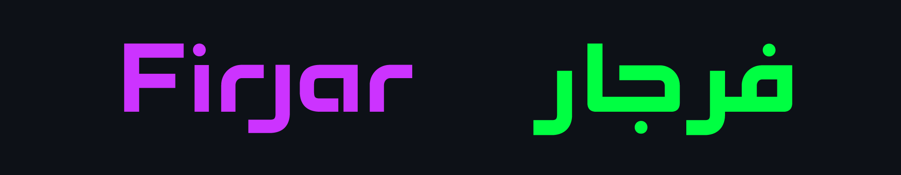
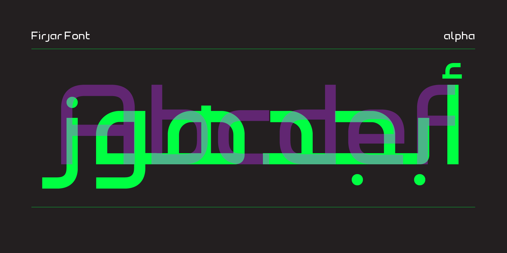
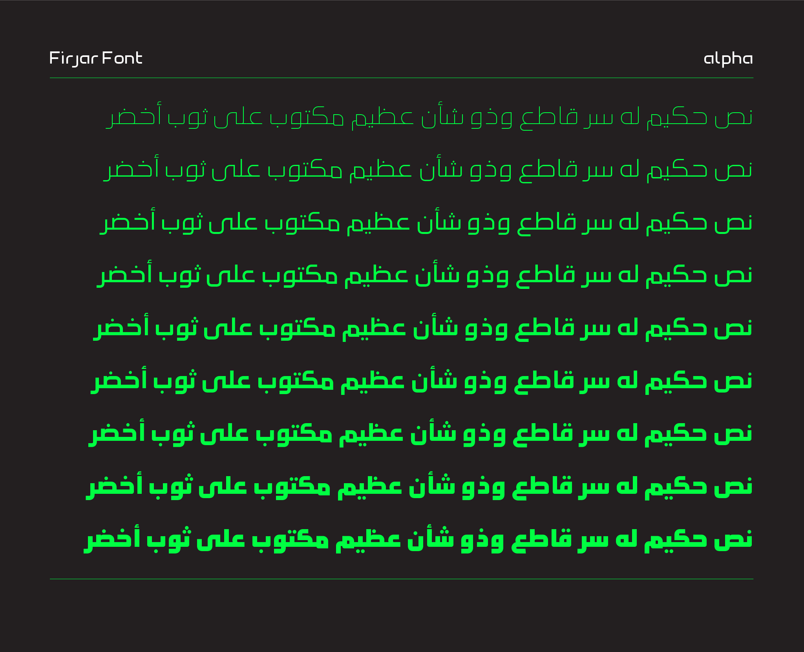
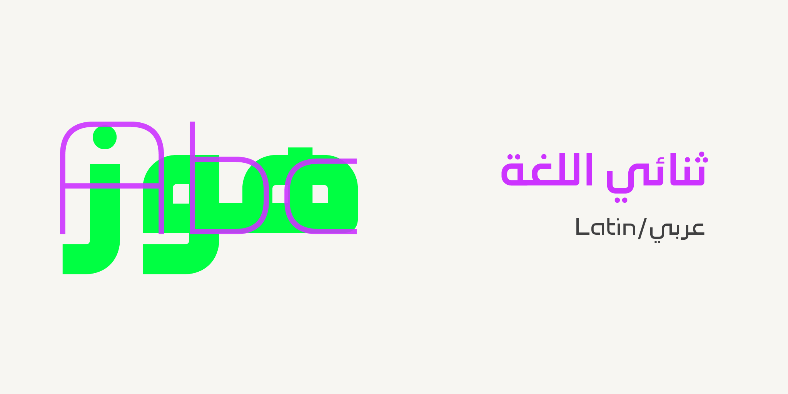
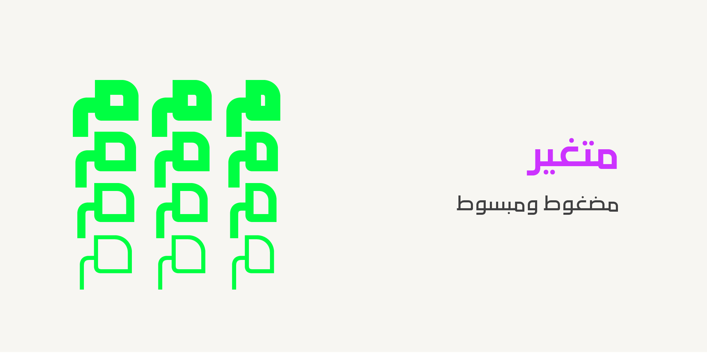
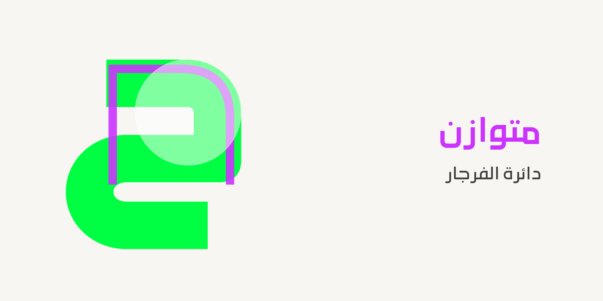

----
# Firjar Font

[![][Fontbakery]](https://mestaratype.github.io/Firjar/fontbakery/fontbakery-report.html)
[![][Universal]](https://mestaratype.github.io/Firjar/fontbakery/fontbakery-report.html)
[![][GF Profile]](https://mestaratype.github.io/Firjar/fontbakery/fontbakery-report.html)
[![][Shaping]](https://mestaratype.github.io/Firjar/fontbakery/fontbakery-report.html)

[Fontbakery]: https://img.shields.io/endpoint?url=https%3A%2F%2Fraw.githubusercontent.com%2Fgooglefonts%2Fgooglefonts-project-template%2Fgh-pages%2Fbadges%2Foverall.json
[GF Profile]: https://img.shields.io/endpoint?url=https%3A%2F%2Fraw.githubusercontent.com%2Fgooglefonts%2Fgooglefonts-project-template%2Fgh-pages%2Fbadges%2FGoogleFonts.json
[Outline Correctness]: https://img.shields.io/endpoint?url=https%3A%2F%2Fraw.githubusercontent.com%2Fgooglefonts%2Fgooglefonts-project-template%2Fgh-pages%2Fbadges%2FOutlineCorrectnessChecks.json
[Shaping]: https://img.shields.io/endpoint?url=https%3A%2F%2Fraw.githubusercontent.com%2Fgooglefonts%2Fgooglefonts-project-template%2Fgh-pages%2Fbadges%2FShapingChecks.json
[Universal]: https://img.shields.io/endpoint?url=https%3A%2F%2Fraw.githubusercontent.com%2Fgooglefonts%2Fgooglefonts-project-template%2Fgh-pages%2Fbadges%2FUniversal.json

Firjar is a contemporary bilingual typeface Arabic and Latin scripts with precision and harmony. Its name, meaning compass in Arabic, reflects its design philosophy.

Firjar comes with modern curves and clean straight lines, Firjar offers a highly versatile system of styles.
The type family includes a wide range of styles, spanning from  condensed to extended widths and from thin to black weights, making it ideal for everything from from bold headlines, branding and UI to editorial and display use.

## Variable Font Axes

Firjar is also a variable font built with:

Axis | Tag | Range | Default | Static Instances
--- | --- | --- | --- | ---
Weight | wght | 100 to 900 | 400 | Thin, ExtraLight, Light, Regular, Medium, Semibold, Bold, Black
Width | wdth | 75 to 120 | 100 | Condensed, Regular, Expanded

#### `wght` (Weight) Axis

The `wght` axis spans Thin (100) to Black (900).

## Building

Fonts are built automatically by GitHub Actions - take a look in the "Actions" tab for the latest build.

If you want to build fonts manually on your own computer:

* `make build` will produce font files.
* `make test` will run [FontBakery](https://github.com/googlefonts/fontbakery)'s quality assurance tests.
* `make proof` will generate HTML proof files.

The proof files and QA tests are also available automatically via GitHub Actions - look at `https://mestaratype.github.io/Firjar/`.

## About

Description of you and/or organisation goes here.

## License

This Font Software is licensed under the SIL Open Font License, Version 1.1.
This license is available with a FAQ at https://openfontlicense.org

## Repository Layout

This font repository structure is inspired by [Unified Font Repository v0.3](https://github.com/unified-font-repository/Unified-Font-Repository), modified for the Google Fonts workflow.
