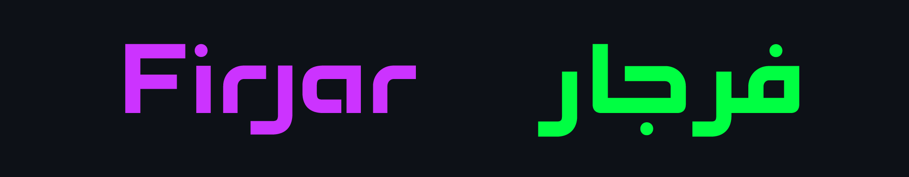
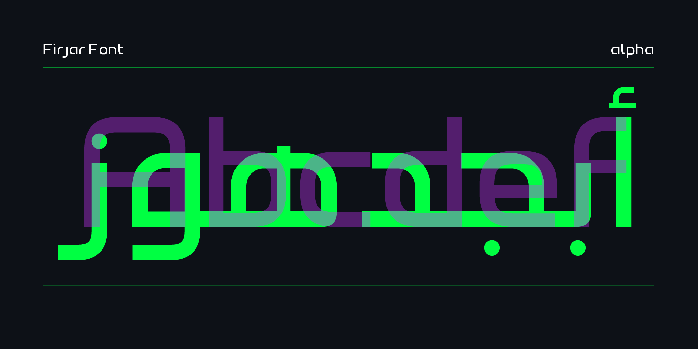
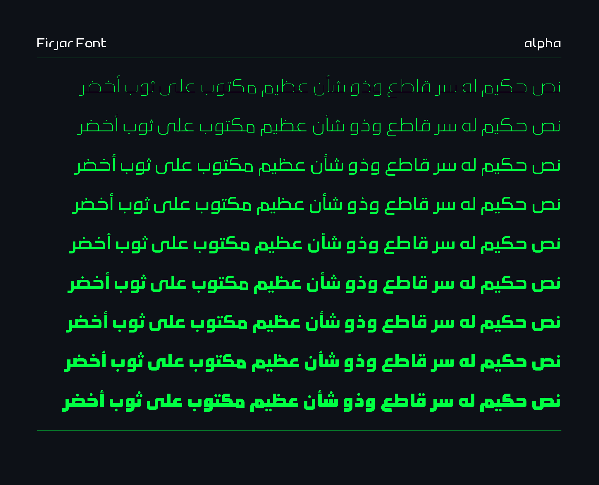
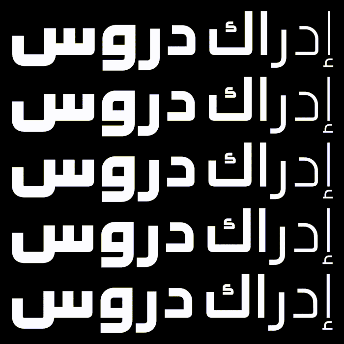
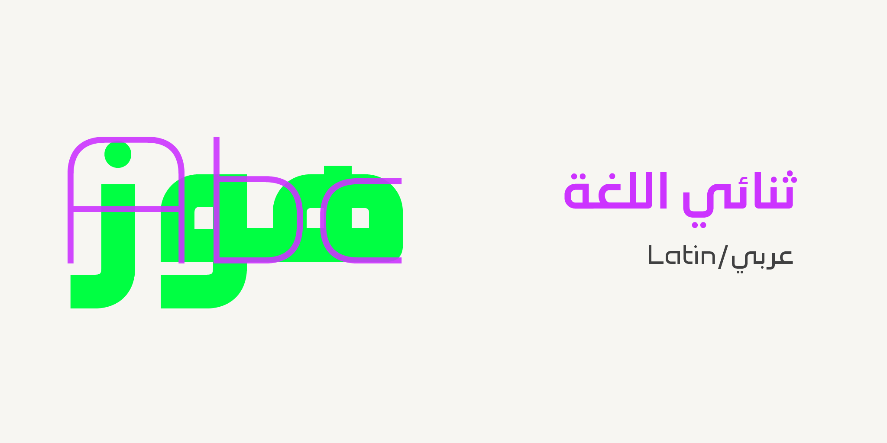
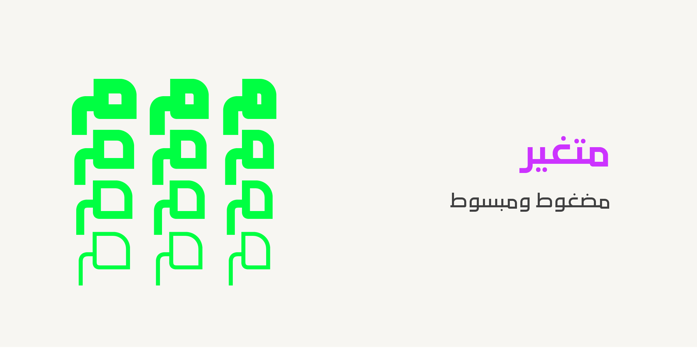
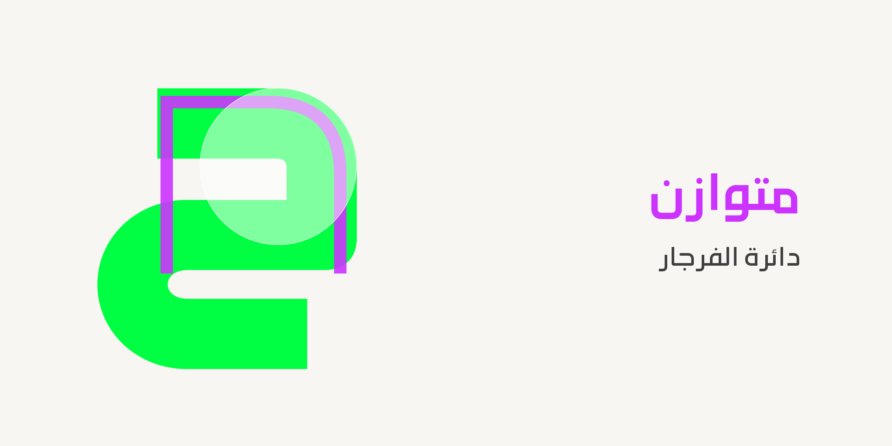

----
# Firjar Font

[![][Fontbakery]](https://mestaratype.github.io/Firjar/fontbakery/fontbakery-report.html)

[Fontbakery]: https://img.shields.io/endpoint?url=https%3A%2F%2Fraw.githubusercontent.com%2Fgooglefonts%2Fgooglefonts-project-template%2Fgh-pages%2Fbadges%2Foverall.json

**Firjar**  is a contemporary Kufic-inspired and minimalist bilingual typeface, covering both Arabic and Latin scripts with precision and harmony. Its name, meaning compass in Arabic, reflects its design philosophy of guidance and balance.

The concept of Firjar draws from the structure of a compass, built using quarter-circle curves combined with clean, straight lines. The type family spans a wide range of styles — from condensed to extended widths and from thin to black weights — making it highly versatile for bold headlines, branding, user interfaces, editorial design, and display applications.

## Variable Font Axes

Firjar is also a variable font built with:

| Axis | Tag | Range | Default | Static Instances |
| --- | --- | --- | --- | --- |
| Weight | wght | 100 to 900 | 400 | Thin, ExtraLight, Light, Regular, Medium, Semibold, Bold, Black |
| Width | wdth | 75 to 125 | 100 | Condensed, SemiCondensed, Regular, SemiExpanded, Expanded |

#### `wght` (Weight) Axis
The `wght` axis spans Thin (100) to Black (900).

---

---

## Roadmap

- [ ] Design and polish Latin Extended glyphs.
- [ ] Expand Latin character set to cover [GF Arabic Core glyphsets](https://github.com/googlefonts/glyphsets/blob/main/Lib/glyphsets/results/nam/GF_Arabic_Core.nam).
- [x] Expanding the width axis range to Exrta condenced and Ultra Expanded.

---

## Contributing

We warmly welcome contributions to **Firjar**!  
Whether you are a type designer, developer, linguist, or simply passionate about typography, your input can help make this project even better.

You can contribute by:
- Improving the design of glyphs.
- Extending language support.
- Optimizing spacing, kerning, or hinting.
- Enhancing the documentation or technical files.
- Reporting issues or suggesting improvements.

### How to contribute
1. Fork the repository
2. Create a new branch for your changes
3. Submit a pull request with a clear description of your work

Please make sure your contributions follow the design philosophy of Firjar — balancing minimalism, readability, and precision across both Arabic and Latin scripts.

Thank you for being part of the open-source type community!  
Together, we can build a better, more flexible font for everyone.

---

## Building

Fonts are built automatically by GitHub Actions - take a look in the "Actions" tab for the latest build.

If you want to build fonts manually on your own computer:

* `make build` will produce font files.
* `make test` will run [FontBakery](https://github.com/googlefonts/fontbakery)'s quality assurance tests.
* `make proof` will generate HTML proof files.

The proof files and QA tests are also available automatically via GitHub Actions - look at (https://mestaratype.github.io/Firjar/).

## About

**Mestara** is a type foundry specialized in creating and designing Arabic typefaces. Founded by a professional calligrapher and designer, Mestara aims to reflect the beauty, and modernity while respecting traditional calligraphic principles. [Visit our website](https://mestara.com)

## License

This Font Software is licensed under the SIL Open Font License, Version 1.1.
This license is available with a FAQ at https://openfontlicense.org

## Repository Layout

This font repository structure is inspired by [Unified Font Repository v0.3](https://github.com/unified-font-repository/Unified-Font-Repository), modified for the Google Fonts workflow.
