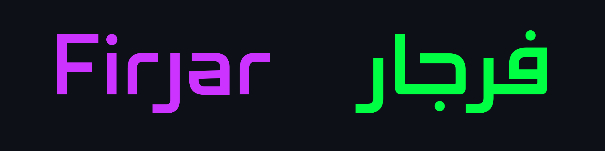

# Firjar Typeface

[![][Fontspector]](https://mestaratype.github.io/Firjar/fontspector/fontspector-report.html)
[![][OpenType]](https://mestaratype.github.io/Firjar/fontspector/fontspector-report.html)
[![][Universal]](https://mestaratype.github.io/Firjar/fontspector/fontspector-report.html)
[![][Google Fonts]](https://mestaratype.github.io/Firjar/fontspector/fontspector-report.html)
[![][Glyphset]](https://mestaratype.github.io/Firjar/fontspector/fontspector-report.html)

[Fontspector]: https://img.shields.io/endpoint?url=https%3A%2F%2Fmestaratype.github.io%2FFirjar%2Fbadges%2FFontspectorQA.json
[OpenType]: https://img.shields.io/endpoint?url=https%3A%2F%2Fmestaratype.github.io%2FFirjar%2Fbadges%2FOpentypeSpecificationChecks.json
[Universal]: https://img.shields.io/endpoint?url=https%3A%2F%2Fmestaratype.github.io%2FFirjar%2Fbadges%2FUniversalProfileChecks.json
[Google Fonts]: https://img.shields.io/endpoint?url=https%3A%2F%2Fmestaratype.github.io%2FFirjar%2Fbadges%2FFontFileChecks.json
[Outline Correctness]: https://img.shields.io/endpoint?url=https%3A%2F%2Fmestaratype.github.io%2FFirjar%2Fbadges%2FOutlineCorrectnessChecks.json
[Glyphset]: https://img.shields.io/endpoint?url=https%3A%2F%2Fmestaratype.github.io%2FFirjar%2Fbadges%2FGlyphsetChecks.json

**Firjar**  is a contemporary Kufic-inspired and minimalist bilingual typeface, covering both Arabic and Latin scripts with precision and harmony. Its name means compass in Arabic. The naming reflects the typeface design philosophy of flexibility and balance.

The concept of Firjar design is inspired by the compass’s capabilities, which are designed using quarter-circled curves combined with clean straight lines. 

## Variable Font Axes

The typeface spans a wide range of styles, from condensed to extended widths and from thin to black weights, making it highly versatile for bold headlines, branding, user interfaces, editorial design, and display applications.

Firjar has the following axes:

| Axis | Tag | Range | Default | Static Instances |
| --- | --- | --- | --- | --- |
| Weight | wght | 100 to 900 | 400 | Thin, ExtraLight, Light, Regular, Semibold, Bold, Black |
| Width | wdth | 75 to 125 | 100 | Condensed, SemiCondensed, Regular, SemiExpanded, Expanded |

#### `wght` (Weight) Axis
The `wght` axis spans Thin (100) to Black (900).

#### `wdth` (Width) Axis
The `wdth` axis spans Condensed (75) to Expanded (125).

---

## Building

Fonts are built automatically by GitHub Actions - take a look in the "Actions" tab for the latest build.

If you want to build fonts manually on your own computer:

* `make build` will produce font files.
* `make test` will run [FontBakery](https://github.com/googlefonts/fontbakery)'s quality assurance tests.
* `make proof` will generate HTML proof files.

The proof files and QA tests are also available automatically via GitHub Actions - look at (https://mestaratype.github.io/Firjar/).

---

## Contributing

We warmly welcome contributions to **Firjar**!  
Whether you are a type designer, developer, linguist, or simply passionate about typography, your input can help make this project even better.

Thank you for being part of the open-source type community!  
Together, we can build a better, more flexible font for everyone.

---

## About

**Mestara** is a type foundry specialized in creating and designing Arabic typefaces. Founded by a professional calligrapher and designer, Mestara aims to reflect the beauty, and modernity while respecting traditional calligraphic principles. [Visit our website](https://mestara.com)

## License

This Font Software is licensed under the SIL Open Font License, Version 1.1.
This license is available with a FAQ at https://openfontlicense.org

## Repository Layout

This font repository structure is inspired by [Unified Font Repository v0.3](https://github.com/unified-font-repository/Unified-Font-Repository), modified for the Google Fonts workflow.
